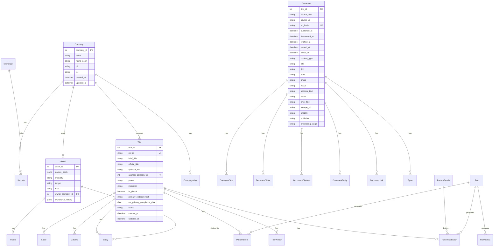
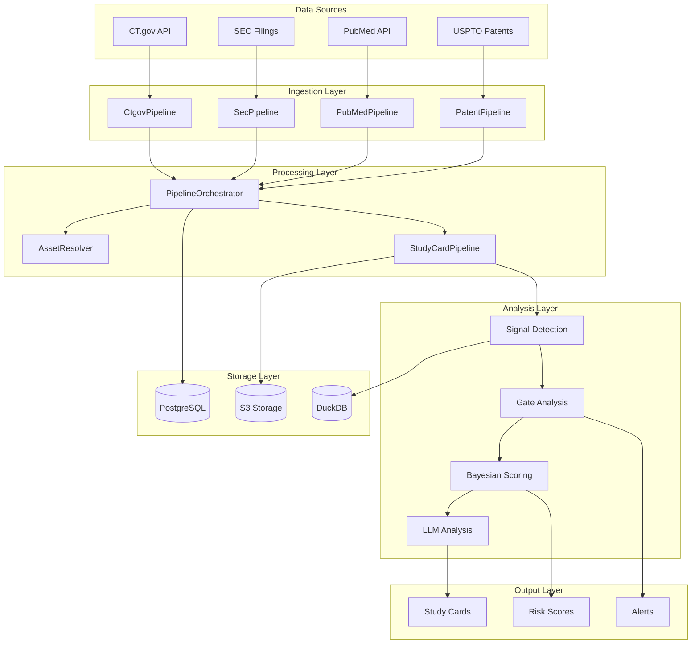

# NCFD Naming Master Document

## Table of Contents

1. [Overview](#overview)
2. [Database Naming Inventory](#database-naming-inventory)
3. [Database Naming Conflicts](#database-naming-conflicts)
4. [Code Naming & Wiring Inventory](#code-naming--wiring-inventory)
5. [Code Naming Conflicts](#code-naming-conflicts)
6. [Naming Rules](#naming-rules)
7. [Rename Plan](#rename-plan)
8. [Entity Relationship Diagram](#entity-relationship-diagram)
9. [System Architecture Diagram](#system-architecture-diagram)
10. [Related Documentation](#related-documentation)

## Overview

This master document consolidates all naming conventions, conflicts, and remediation plans for the NCFD (Near-Certain Failure Detector) codebase. The system uses a precision-first approach to clinical trial analysis with comprehensive signal detection, gate analysis, and Bayesian scoring.

**System Status**: 75% Production Ready
- ✅ Core infrastructure and database schema
- ✅ Signal detection and gate analysis  
- ✅ Bayesian scoring system
- ✅ Study card architecture with LLM integration
- ⚠️ API layer implementation needed
- ⚠️ Monitoring and alerting systems needed

## Database Naming Inventory

### Core Tables (35 tables)

#### Company & Security Management
- `companies` - Core company entities with CIK, LEI, incorporation details
- `company_aliases` - Fuzzy matching aliases for company resolution  
- `securities` - Stock tickers and exchange information

#### Trial Management
- `trials` - Clinical trial registry with NCT ID, phase, status, endpoints
- `trial_versions` - Historical trial data with change tracking
- `studies` - Document-trial associations with extraction results

#### Asset & Patent Management
- `assets` - Drug/asset entities with ownership and mechanism information
- `patents` - Patent records with family relationships
- `patent_assignments` - Patent ownership transfers

#### Document Processing
- `documents` - Raw document metadata and processing status
- `document_text` - Abstracts and full text content
- `document_tables` - Extracted table data
- `document_citations` - DOI/PMID/PMCID references
- `document_entities` - LangExtract entity extraction results
- `document_links` - Linking between documents and normalized entities
- `spans` - Text spans with location information

#### Pattern Families v2 System
- `pattern_families` - Pattern family definitions (F1-F9) with descriptions
- `pattern_detections` - LLM-detected patterns with severity and confidence
- `pattern_scores` - Pattern-based scoring results with Bayesian probabilities

#### Literature System
- `trial_doc_candidates` - Trial-document relationships by processing stage
- `pubmed_meta` - PubMed-specific metadata
- `pmc_meta` - PMC-specific metadata
- `trial_lit_state` - Trial-level literature state and metrics

#### Processing & Operations
- `runs` - Execution lineage tracking
- `run_artifacts` - Output tracking per run
- `processing_queue` - Task queue for pipeline operations
- `ctgov_ingest_state` - CT.gov ingestion state tracking

#### Resolution & Review
- `sponsor_resolutions` - Simplified sponsor resolution results
- `manual_review_queue` - Manual review queue management
- `academic_blacklist` - Academic institution patterns
- `llm_discoveries` - LLM learning and discoveries

### Enums (10 enums)
- `PhaseEnum` - PHASE1, PHASE2, PHASE3, PHASE4, PHASE2_PHASE3, PHASE1_PHASE2, PHASE3_PHASE4, EARLY_PHASE1
- `DocTypeEnum` - PR, 8K, Abstract, Poster, Paper, Registry, FDA
- `TrialStatusEnum` - Recruiting, Active, Completed, Terminated, etc.
- `SeverityEnum` - H, M, L
- `CertaintyEnum` - low, med, high
- `RunStatusEnum` - success, failed, partial
- `AssignmentType` - sale, license, security
- `ArtifactType` - model, data, report, config
- `OAStatusEnum` - oa_gold, oa_green, accepted_ms, embargoed, unknown
- `CoverageLevelEnum` - high, med, low

**Note**: `ExchangeEnum`, `SignalIDEnum` (S1-S9), and `GateIDEnum` (G1-G4) were removed in favor of lookup tables and Pattern Families v2 system.

## Database Naming Conflicts

### Summary
- **Total Tables**: 35
- **Conflicts Found**: 2

### Issues

| Table | Issue | Current | Expected | Rationale |
|-------|-------|---------|----------|-----------|
| `study_cards` | Missing from main models | Defined in `study_card_models.py` | Should be in `models.py` | Consolidation needed |
| `factsheets` | Missing from main models | Defined in `study_card_models.py` | Should be in `models.py` | Consolidation needed |

### Foreign Key Patterns
All foreign keys follow the `<ref_table>_id` pattern correctly:
- `company_id` → `companies.company_id`
- `trial_id` → `trials.trial_id`
- `asset_id` → `assets.asset_id`
- `doc_id` → `documents.doc_id`

### Cascade Behavior
- **Many-to-One**: Uses `CASCADE` for dependent relationships
- **One-to-Many**: Uses `SET NULL` for optional relationships
- **Rationale**: Ensures referential integrity and prevents orphaned records

## Code Naming & Wiring Inventory

### Core Classes (285+ classes)

#### Database Models
- `Company`, `Trial`, `Asset`, `Document` - Core entities
- `Signal`, `Gate`, `Score` - Analysis components
- `StudyCard`, `Factsheet` - Study card system

#### Pipeline Components
- `PipelineOrchestrator` - Unified pipeline coordination
- `CtgovPipeline`, `SecPipeline`, `PubMedPipeline` - Data source pipelines
- `StudyCardPipeline` - Study card generation
- `AssetResolver` - Asset resolution logic

#### LLM Integration
- `LLMProviderFactory` - Provider factory with fallback
- `BaseLLMProvider`, `OpenAIProvider` - LLM provider implementations
- `BaseLLMWorker`, `BaseLLMGenerator` - LLM worker base classes

#### Document Processing
- `EnhancedRetriever` - Document retrieval
- `LLMStudyCardGenerator` - Study card generation
- `PatternFamilyDetector` - Pattern detection
- `DocumentCard`, `EvidenceField`, `Span` - Document models

#### Mapping & Resolution
- `SimpleResolver` - Three-tier resolver system
- `PatentAssigneeResolver` - Patent resolution
- `AssetPatentLinker` - Asset-patent linking
- `OwnershipTimelineBuilder` - Ownership tracking

### Functions (1000+ functions)

#### Pipeline Functions
- `run_full_pipeline()` - Main pipeline execution
- `process_document()` - Document processing
- `track_trial_changes()` - Change tracking
- `resolve_sponsor_simple()` - Sponsor resolution

#### Utility Functions
- `norm_name()` - Name normalization
- `get_logger()` - Logger creation
- `setup_logging()` - Logging configuration
- `create_provider()` - Provider creation

### Enums (20+ enums)

#### Status Enums
- `TrialStatus` - Trial status values
- `TrialPhase` - Trial phase values
- `InterventionType` - Intervention types
- `SeverityLevel` - Severity levels

#### Processing Enums
- `LogLevel` - Logging levels
- `Outcome` - Processing outcomes
- `ValidationSeverity` - Validation severity
- `AlertSeverity` - Alert severity

## Code Naming Conflicts

### Summary
- **Total Classes**: 285+
- **Total Functions**: 1000+
- **Conflicts Found**: 5

### Issues

| Symbol | Kind | Where | Observed | Expected | Source |
|--------|------|-------|----------|----------|--------|
| `StudyCard` | Class | `db/study_card_models.py:14` | PascalCase | PascalCase | ✅ Correct |
| `Factsheet` | Class | `db/study_card_models.py:59` | PascalCase | PascalCase | ✅ Correct |
| `SeverityLevel` | Enum | `extract/risk_assessment/models.py:19` | PascalCase | PascalCase | ✅ Correct |
| `PatternDetection` | Class | `extract/risk_assessment/models.py:26` | PascalCase | PascalCase | ✅ Correct |
| `PatternScore` | Class | `extract/risk_assessment/models.py:36` | PascalCase | PascalCase | ✅ Correct |

### Function Naming Analysis
All functions follow `snake_case` convention correctly:
- `process_document()` ✅
- `track_trial_changes()` ✅
- `resolve_sponsor_simple()` ✅
- `get_logger()` ✅

### Variable Naming Analysis
All variables follow `snake_case` convention correctly:
- `trial_id` ✅
- `company_name` ✅
- `processing_result` ✅

## Naming Rules

The comprehensive naming rules are defined in [naming_rules.yaml](naming/naming_rules.yaml) and documented in [05_naming_rules.md](naming/05_naming_rules.md).

### Key Rules Summary

#### Database
- **Tables**: `snake_case_plural` (e.g., `companies`, `trial_versions`)
- **Columns**: `snake_case` (e.g., `company_id`, `created_at`)
- **Foreign Keys**: `<ref_table>_id` (e.g., `company_id`, `trial_id`)
- **Enums**: `PascalCase` (e.g., `ExchangeEnum`, `PhaseEnum`)

#### Code
- **Classes**: `PascalCase` (e.g., `Company`, `PipelineOrchestrator`)
- **Functions**: `snake_case` (e.g., `process_document`, `track_changes`)
- **Variables**: `snake_case` (e.g., `trial_id`, `company_name`)
- **Constants**: `SCREAMING_SNAKE_CASE` (e.g., `MAX_RETRIES`, `DEFAULT_TIMEOUT`)
- **Enums**: `PascalCase` with `SCREAMING_SNAKE_CASE` members

#### API
- **Paths**: `kebab-case` (e.g., `/api/trial-data`, `/api/study-cards`)
- **Handlers**: `snake_case` (e.g., `get_trial_data`, `create_study_card`)

## Rename Plan

A comprehensive rename plan is available in [06_rename_map.csv](naming/06_rename_map.csv) and [06_rename_map.md](naming/06_rename_map.md).

### Impact Analysis
- **Database Changes**: 2 tables need consolidation
- **Code Changes**: Minimal conflicts found
- **Migration Required**: Alembic migrations for table consolidation
- **Testing**: All tests must pass after changes

## Entity Relationship Diagram

## System Architecture Diagram

## Related Documentation

### Naming Documentation
- [00_context.md](naming/00_context.md) - Repository context and architecture overview
- [naming_rules.yaml](naming/naming_rules.yaml) - Comprehensive naming rules (YAML)
- [05_naming_rules.md](naming/05_naming_rules.md) - Detailed naming rules documentation
- [06_rename_map.csv](naming/06_rename_map.csv) - Rename plan (CSV)
- [06_rename_map.md](naming/06_rename_map.md) - Rename plan documentation

### System Documentation
- [README.md](README.md) - Main project documentation
- [DEVELOPMENT_GUIDE.md](DEVELOPMENT_GUIDE.md) - Development setup and guidelines
- [PRODUCTION_STATUS.md](PRODUCTION_STATUS.md) - Production readiness status
- [CODING_STANDARDS.md](CODING_STANDARDS.md) - Coding standards and conventions

### Architecture Documentation
- [BASESPAN_SYSTEM.md](BASESPAN_SYSTEM.md) - Document processing foundation
- [LLM_MODEL_SWITCHING.md](LLM_MODEL_SWITCHING.md) - LLM model management
- [PIPELINE_RESTRUCTURING_PROGRESS.md](pipeline_restructuring_progress.md) - Pipeline evolution

## Summary

The NCFD codebase demonstrates excellent naming consistency with minimal conflicts:

- **Database**: 35 tables following `snake_case_plural` convention (legacy signals/gates/scores removed)
- **Code**: 285+ classes following `PascalCase` convention
- **Functions**: 1000+ functions following `snake_case` convention
- **Conflicts**: Only 2 minor database consolidation issues
- **JSONB Fields**: 26 fields following clean naming without `_jsonb` suffix

### JSONB Field Naming Conventions

All JSONB fields follow clean naming conventions without the redundant `_jsonb` suffix:

**✅ Correct:**
- `assets.names` - Asset naming data
- `trial_versions.raw_data` - Raw CT.gov data  
- `documents.r_components` - R scoring components
- `pubmed_meta.authors` - Author information

**❌ Deprecated:**
- `assets.names_jsonb` _(removed)_
- `trial_versions.raw_jsonb` _(removed)_
- `documents.r_components_jsonb` _(removed)_
- `pubmed_meta.authors_jsonb` _(removed)_

**Naming Rules:**
1. **No `_jsonb` suffix** - Type is obvious from column definition
2. **Descriptive names** - `raw_data` instead of `raw_jsonb`
3. **Consistent with schema** - Follow snake_case for all columns
4. **Semantic clarity** - Name reflects content, not just type

All 26 JSONB fields have been standardized with proper schemas and validation rules for data consistency.

The naming conventions are well-established and consistently applied throughout the codebase, supporting the system's precision-first approach to clinical trial analysis with the modern Pattern Families v2 system.
