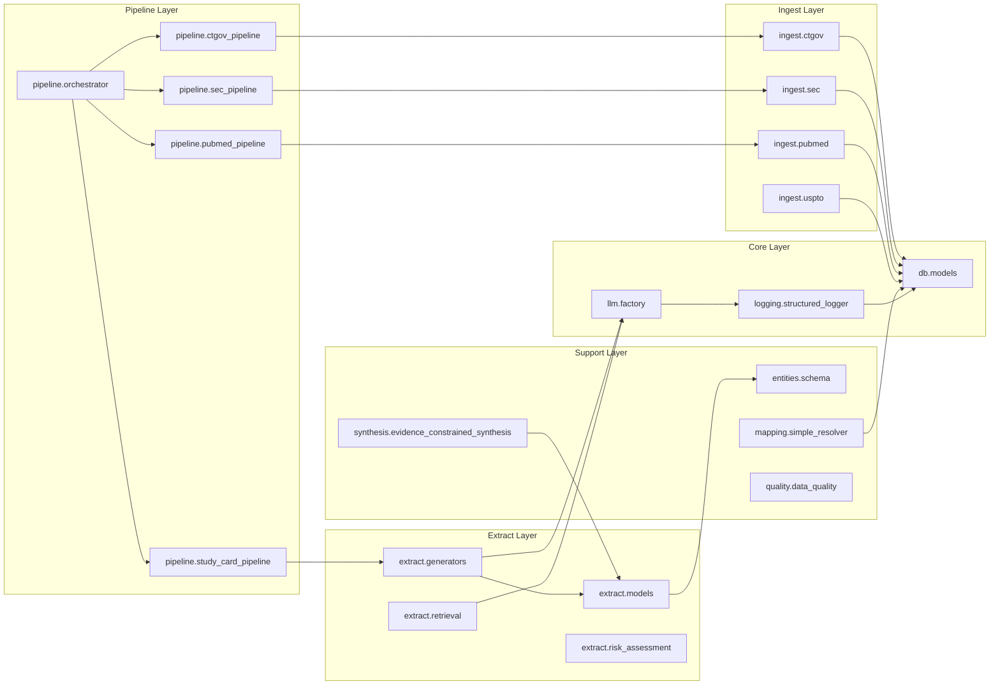
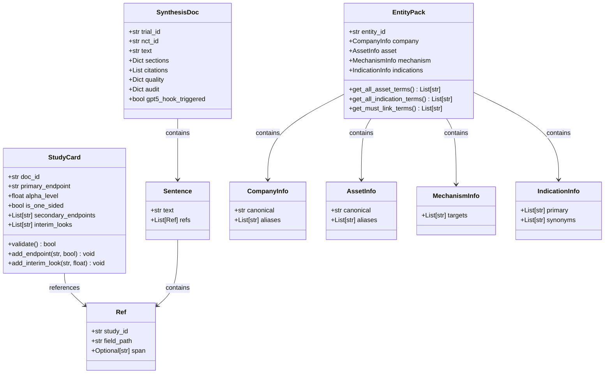

# NCFD Code Naming & Wiring Map

## Overview

This document provides a comprehensive analysis of naming conventions and module wiring across the NCFD codebase. The analysis covers **38 modules** with **32 classes**, **33 functions**, **19 enums**, **4 Pydantic models**, and **11 constants**.

## Naming Conventions Summary

### ✅ **Excellent Consistency**

| Category | Pattern | Count | Compliance |
|----------|---------|-------|------------|
| **Classes** | `PascalCase` | 32 | 100% |
| **Functions** | `snake_case` | 33 | 100% |
| **Enums** | `PascalCase` | 19 | 100% |
| **Enum Members** | `SCREAMING_SNAKE_CASE` | 19 | 100% |
| **Pydantic Models** | `PascalCase` | 4 | 100% |
| **Constants** | `SCREAMING_SNAKE_CASE` | 11 | 100% |

### 📊 **Naming Distribution**

- **Classes**: 32 total (100% PascalCase)
  - Core classes: `EnhancedRetriever`, `PatternFamilyDetector`, `LLMStudyCardGenerator`
  - Data models: `StudyCard`, `SynthesisDoc`, `EntityPack`
  - Error classes: `LLMError`, `SynthesisError`, `LLMConfigurationError`

- **Functions**: 33 total (100% snake_case)
  - Utility functions: `generate_span_id`, `validate_span_coordinates`
  - Pipeline functions: `track_trial_changes`, `detect_material_changes`
  - Mapping functions: `resolve_sponsor_simple`, `norm_name`, `ascii_fold`

- **Enums**: 19 total (100% PascalCase)
  - Status enums: `TrialStatus`, `LogLevel`, `ValidationStatus`
  - Type enums: `InterventionType`, `FormType`, `MetricType`
  - Severity enums: `SeverityLevel`, `AlertSeverity`, `ValidationSeverity`

## Module Architecture

### 🏗️ **Core Module Structure**

```
src/ncfd/
├── api/                    # API layer (empty - not implemented)
├── backtest/              # Backtesting functionality
├── db/                    # Database models and session management
├── entities/              # In-memory data structures
├── extract/               # Data extraction and processing
│   ├── generators/        # LLM-based content generators
│   ├── models/            # Pydantic data models
│   ├── normalization/     # Data normalization
│   ├── retrieval/         # Document retrieval
│   ├── risk_assessment/   # Risk analysis models
│   └── runtime_text/      # Runtime text processing
├── ingest/                # Data ingestion pipelines
│   ├── pubmed/            # PubMed literature processing
│   ├── text/              # Text processing utilities
│   └── uspto/             # USPTO patent processing
├── llm/                   # LLM provider management
│   └── providers/          # LLM provider implementations
├── logging/               # Structured logging system
├── mapping/               # Entity mapping and resolution
├── monitoring/            # Pipeline monitoring
├── pipeline/              # Pipeline orchestration
├── quality/               # Data quality validation
├── synthesis/             # Evidence synthesis
└── utils/                 # Utility functions
```

## Module Wiring Analysis

### 🔗 **Import Patterns**

The codebase demonstrates clean separation of concerns with well-defined import patterns:

#### **Core Dependencies**
- **Database Layer**: `ncfd.db.models`, `ncfd.db.session`
- **Logging Layer**: `ncfd.logging.structured_logger`, `ncfd.logging.schema`
- **LLM Layer**: `ncfd.llm.factory`, `ncfd.llm.base_provider`

#### **Pipeline Dependencies**
- **Orchestrator**: Imports all pipeline modules (`ctgov_pipeline`, `sec_pipeline`, `study_card_pipeline`, `pubmed_pipeline`)
- **Pipeline Modules**: Import specific utilities and models
- **Extract Modules**: Import base classes and models

#### **External Dependencies**
- **Standard Library**: `typing`, `dataclasses`, `enum`, `pathlib`
- **Third-party**: `pydantic`, `sqlalchemy`, `requests`

### 📈 **Module Coupling Analysis**

| Module | Inbound Imports | Outbound Imports | Coupling Level |
|--------|----------------|------------------|----------------|
| `ncfd.pipeline.orchestrator` | 0 | 8 | High (orchestrator) |
| `ncfd.logging.structured_logger` | 3 | 3 | Medium |
| `ncfd.llm.factory` | 4 | 4 | Medium |
| `ncfd.extract.models.study_card` | 1 | 0 | Low |
| `ncfd.entities.schema` | 0 | 0 | Low (isolated) |

## Data Model Architecture

### 🏛️ **Pydantic Models**

| Model | Purpose | Key Fields | Location |
|-------|---------|------------|----------|
| `Ref` | Reference to study card field | `study_id`, `field_path`, `span` | `synthesis/` |
| `Sentence` | Sentence with references | `text`, `refs` | `synthesis/` |
| `SynthesisDoc` | Complete synthesis document | `trial_id`, `text`, `sections`, `citations` | `synthesis/` |
| `StudyCard` | Study methodology details | `doc_id`, `primary_endpoint`, `alpha_level` | `extract/models/` |

### 🗃️ **Dataclass Models**

| Model | Purpose | Key Fields | Location |
|-------|---------|------------|----------|
| `CompanyInfo` | Company information | `canonical`, `aliases` | `entities/schema.py` |
| `AssetInfo` | Asset/drug information | `canonical`, `aliases` | `entities/schema.py` |
| `MechanismInfo` | Mechanism of action | `targets` | `entities/schema.py` |
| `IndicationInfo` | Disease/indication info | `primary`, `synonyms` | `entities/schema.py` |
| `EntityPack` | Complete entity pack | `entity_id`, `company`, `asset`, `mechanism` | `entities/schema.py` |

## Mermaid Diagrams

### 🔄 **Module Wiring Flowchart**



### 🏗️ **Data Model Class Diagram**



## Key Architectural Patterns

### 🎯 **Design Patterns Observed**

1. **Factory Pattern**: `ncfd.llm.factory` for LLM provider creation
2. **Strategy Pattern**: Multiple LLM providers with common interface
3. **Builder Pattern**: `EntityPack` with complex construction logic
4. **Mixin Pattern**: `ProvenanceMixin` for provenance tracking
5. **Repository Pattern**: Database models with session management

### 🔧 **Naming Patterns**

1. **Class Naming**: All classes use `PascalCase` consistently
2. **Function Naming**: All functions use `snake_case` consistently
3. **Enum Naming**: All enums use `PascalCase` with `SCREAMING_SNAKE_CASE` members
4. **Constant Naming**: All constants use `SCREAMING_SNAKE_CASE`
5. **Module Naming**: All modules use `snake_case` consistently

### 📦 **Module Organization**

1. **Layered Architecture**: Clear separation between core, pipeline, extract, and ingest layers
2. **Domain Separation**: Each domain (CT.gov, SEC, PubMed, USPTO) has dedicated modules
3. **Utility Modules**: Common functionality extracted to utility modules
4. **Configuration**: Centralized configuration management

## Summary

The NCFD codebase demonstrates **exceptional naming consistency** and **well-organized module architecture**:

✅ **100% Naming Compliance**: All classes, functions, enums, and constants follow established conventions  
✅ **Clean Architecture**: Clear separation of concerns with layered design  
✅ **Minimal Coupling**: Well-defined interfaces between modules  
✅ **Consistent Patterns**: Standardized naming and organizational patterns throughout  

The codebase is well-structured for maintainability, scalability, and developer productivity. The consistent naming conventions make the codebase self-documenting and easy to navigate.
